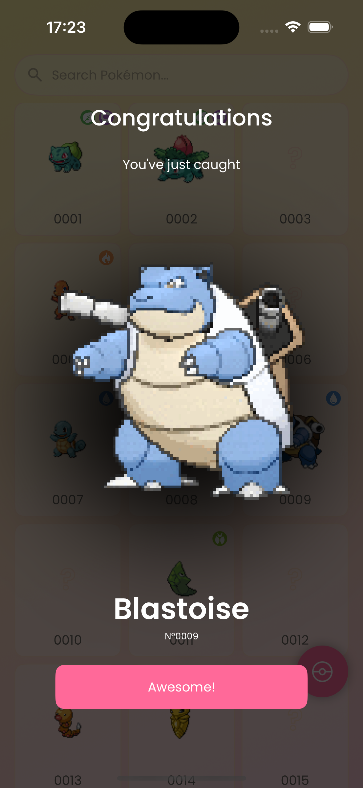

# Snapdex - SwiftUI Edition

  

Snapdex is a production-quality **Pokédex-style app** built with Swift and SwiftUI. Users can snap pictures of Pokémon merchandise found in the wild (plushes, trading cards, etc.) to complete their own Pokédex, thanks to AI-powered recognition using **TensorFlow Lite** and **OpenAI**. This project serves as both a **learning experience** and a **professional showcase** of modern iOS app development.

  
  
  
  
  

*Design by [Rui Zhang](https://www.linkedin.com/in/ruizhang77); Pokémon detail page heavily inspired by Figma design by [Junior Savaria](https://www.figma.com/community/file/1202971127473077147)*

## 🚀 Features

- Snap photos of Pokémon merchandise with your device camera
- AI-powered Pokémon recognition using **TensorFlow Lite (on-device)** and **OpenAI API (cloud)**
- Complete your personal Pokédex by discovering Pokémon-themed items in the real world
- Offline-first architecture with Firebase Cloud sync
- Full Light/Dark Mode support with custom theming

## 🛠️ Technical Highlights

I'm planning to use the following technologies

### Core Technologies
- Swift 6.1
- SwiftUI
- Xcode 16+
- Combine for reactive state management

### Architecture & Patterns
- MVVM architecture
- Repository pattern
- Dependency injection

### Networking & Data
- `URLSession` + `Async/Await` for API calls
- `Codable` for JSON parsing
- **Firebase Firestore** for real-time cloud data
- **Firebase Authentication** for sign-in
- `UserDefaults` and `@AppStorage` for local preferences

### AI & Image Processing
- **TensorFlow Lite** for fast on-device Pokémon recognition (via [TensorFlowLiteSwift](https://github.com/tensorflow/tensorflow/tree/master/tensorflow/lite/experimental/swift))
- **OpenAI API** for high-accuracy fallback recognition
- `PhotosUI` for image capture and library access

### Analytics & Beta Testing
- Firebase Analytics for insights
- Firebase Crashlytics for error reporting
- Firebase App Distribution for internal testing

### Security
- OpenAI API key stored securely using the Keychain
- Firebase Authentication (email, anonymous, Apple Sign-In)

## 📱 How to Build

TBA

## 📄 License

This project is licensed under the Apache 2.0 License - see the LICENSE file for details.