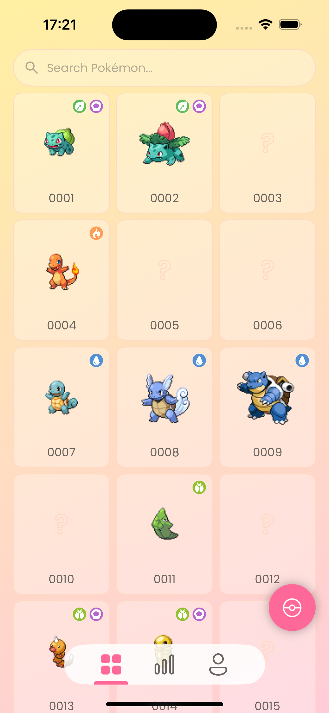

# Snapdex - SwiftUI Edition

_Check out [Snapdex – Compose Edition](https://github.com/TimLariviere/Snapdex-Compose) to see my Android development in action._

  

Snapdex is a production-quality **Pokédex-style app** built with Swift and SwiftUI. Users can snap pictures of Pokémon merchandise found in the wild (plushes, trading cards, etc.) to complete their own Pokédex, thanks to AI-powered recognition using **TensorFlow Lite** and **OpenAI**. This project serves as both a **learning experience** and a **professional showcase** of modern iOS app development.

  
  
  
  
  

*Design by [Rui Zhang](https://www.linkedin.com/in/ruizhang77); Pokémon detail page heavily inspired by Figma design by [Junior Savaria](https://www.figma.com/community/file/1202971127473077147)*

## 🚀 Features

- Snap photos of Pokémon merchandise with your device camera
- AI-powered Pokémon recognition using **TensorFlow Lite (on-device)** and **OpenAI API (cloud)**
- Complete your personal Pokédex by discovering Pokémon-themed items in the real world
- Offline-first architecture with Firebase Cloud sync
- Full Light/Dark Mode support with custom theming

## 🛠️ Technical Highlights

I'm planning to use the following technologies:

### Core Technologies
- Swift 6+
- SwiftUI
- Fastlane

### Architecture & Design Patterns
- MVVM Architecture
- Repository Pattern
- Dependency Injection

### Networking & Data
- Alamofire: HTTP client
- Realm: Local database with offline-first approach
- Firebase Firestore: Cloud data synchronization

### Authentication & Security
- Firebase Authentication
- Cryptography: Secure encrypted storage for OpenAI API keys

### Image Processing
- TensorFlow Lite: On-device Pokemon recognition
- OpenAI API: Cloud-based recognition for improved accuracy
- Kingfisher: Image loading library with caching support

### Analytics & Monitoring
- Firebase Analytics
- Firebase Crashlytics
- Firebase App Distribution: Beta testing and deployment

## 📱 How to Build

TBA

## 📄 License

This project is licensed under the Apache 2.0 License - see the LICENSE file for details.